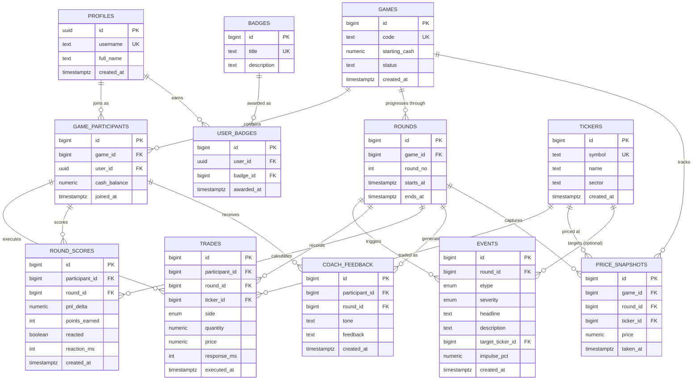

# Hedge - Market Simulation Game

## Database Design

### Overview

Hedge is an event-driven trading simulation game where players react to Black Swan market events in real-time. The database is designed to support:

- **Fast-paced gameplay**: Quick rounds (5-15 minutes) with 30-second decision windows
- **Event-driven mechanics**: Random market shocks (interest rate changes, geopolitical crises, earnings surprises)
- **Multi-player sessions**: Support for competitive and solo gameplay
- **AI coaching**: Post-round behavioral analysis and personalized feedback
- **Progression system**: Badges, leaderboards, and skill tracking

The data model balances normalization for data integrity with denormalization for performance, particularly in time-sensitive queries during active gameplay.

### Entity Relationship Diagram


### Tables Description

#### Core User & Game Management

- **profiles**: Stores user account information
  - `id` (UUID): Primary key, auto-generated
  - `username` (TEXT): Unique display name for leaderboards
  - `full_name` (TEXT): User's full name
  - `created_at` (TIMESTAMPTZ): Account creation timestamp

- **games**: Represents individual game sessions
  - `id` (BIGINT): Primary key, auto-increment
  - `code` (TEXT): Unique game join code
  - `starting_cash` (NUMERIC): Initial capital for all participants
  - `status` (TEXT): Game state (default: 'PENDING')
  - `created_at` (TIMESTAMPTZ): Game creation time

- **game_participants**: Junction table linking players to games
  - `id` (BIGINT): Primary key, auto-increment
  - `game_id` (BIGINT): Foreign key to games
  - `user_id` (UUID): Foreign key to profiles
  - `cash_balance` (NUMERIC): Current available cash (default: 0)
  - `joined_at` (TIMESTAMPTZ): When player joined the game

#### Gameplay Mechanics

- **rounds**: Individual trading rounds within a game
  - `id` (BIGINT): Primary key, auto-increment
  - `game_id` (BIGINT): Foreign key to games
  - `round_no` (INTEGER): Sequential round number (must be >= 1)
  - `starts_at` (TIMESTAMPTZ): Round start time
  - `ends_at` (TIMESTAMPTZ): Round end time

- **events**: Black Swan market events triggered during rounds
  - `id` (BIGINT): Primary key, auto-increment
  - `round_id` (BIGINT): Foreign key to rounds
  - `etype` (ENUM): Event type (user-defined enum)
  - `severity` (ENUM): Event severity level (user-defined enum, default: 'NORMAL')
  - `headline` (TEXT): Brief event headline
  - `description` (TEXT): Full event details
  - `target_ticker_id` (BIGINT): Optional foreign key to specific affected ticker
  - `impulse_pct` (NUMERIC): Percentage price impact
  - `created_at` (TIMESTAMPTZ): Event creation timestamp

- **trades**: Player buy/sell transactions
  - `id` (BIGINT): Primary key, auto-increment
  - `participant_id` (BIGINT): Foreign key to game_participants
  - `round_id` (BIGINT): Foreign key to rounds
  - `ticker_id` (BIGINT): Foreign key to tickers
  - `side` (ENUM): Buy or sell (user-defined enum)
  - `quantity` (NUMERIC): Number of shares
  - `price` (NUMERIC): Execution price per share
  - `response_ms` (INTEGER): Reaction time in milliseconds
  - `executed_at` (TIMESTAMPTZ): Trade execution timestamp

#### Market Data

- **tickers**: Reference data for tradable stocks
  - `id` (BIGINT): Primary key, auto-increment
  - `symbol` (TEXT): Stock ticker symbol (e.g., 'AAPL'), unique
  - `name` (TEXT): Company name
  - `sector` (TEXT): Industry classification
  - `created_at` (TIMESTAMPTZ): Record creation timestamp

- **price_snapshots**: Historical price records
  - `id` (BIGINT): Primary key, auto-increment
  - `game_id` (BIGINT): Foreign key to games
  - `round_id` (BIGINT): Foreign key to rounds
  - `ticker_id` (BIGINT): Foreign key to tickers
  - `price` (NUMERIC): Price at snapshot time
  - `taken_at` (TIMESTAMPTZ): Snapshot timestamp

#### Performance Tracking

- **round_scores**: Player performance metrics per round
  - `id` (BIGINT): Primary key, auto-increment
  - `participant_id` (BIGINT): Foreign key to game_participants
  - `round_id` (BIGINT): Foreign key to rounds
  - `pnl_delta` (NUMERIC): Profit/loss change for this round (default: 0)
  - `points_earned` (INTEGER): Game points awarded (default: 0)
  - `reacted` (BOOLEAN): Whether player made any trades (default: false)
  - `reaction_ms` (INTEGER): Time to first trade in milliseconds
  - `created_at` (TIMESTAMPTZ): Score calculation timestamp

- **coach_feedback**: AI-generated insights and recommendations
  - `id` (BIGINT): Primary key, auto-increment
  - `participant_id` (BIGINT): Foreign key to game_participants
  - `round_id` (BIGINT): Foreign key to rounds
  - `tone` (TEXT): Feedback style ('Serious' or 'Playful')
  - `feedback` (TEXT): Natural language analysis
  - `created_at` (TIMESTAMPTZ): Feedback generation timestamp

#### Progression System

- **badges**: Unlockable achievements
  - `id` (BIGINT): Primary key, auto-increment
  - `title` (TEXT): Unique badge name
  - `description` (TEXT): Achievement criteria description

- **user_badges**: Player badge awards
  - `id` (BIGINT): Primary key, auto-increment
  - `user_id` (UUID): Foreign key to profiles
  - `badge_id` (BIGINT): Foreign key to badges
  - `awarded_at` (TIMESTAMPTZ): Award timestamp

#### Views

- **v_participant_network**: Social graph of players who competed together
  - Used for matchmaking and friend suggestions
  - Aggregates game participation data to show connection strength

### Security Model

The database implements Row Level Security (RLS) to enforce data access control at the PostgreSQL level, ensuring that even direct database access respects authorization rules.

#### Access Control Strategy

**Public Reference Data**: Tables containing game content (tickers, events, badges) allow universal read access since they contain no sensitive user information.

**User-Specific Data**: Tables storing player information (profiles, trades, coach_feedback) restrict access to the owning user via `auth.uid()` checks.

**Game-Scoped Data**: Tables related to game sessions (games, rounds, round_scores) grant access only to participants of that game through subquery existence checks.

#### RLS Policies by Table

- **profiles**
  - SELECT: Public (all users can view profiles for leaderboards)
  - UPDATE: Own profile only (`auth.uid() = id`)
  - Rationale: Public profiles enable social features while protecting write access

- **games, rounds, game_participants**
  - SELECT: Participants only (via game_participants join)
  - Rationale: Game data is private to players involved

- **trades, round_scores, coach_feedback**
  - SELECT/INSERT: Own data only (`participant_id = auth.uid()`)
  - Rationale: Financial decisions and performance data are strictly private

- **tickers, events, badges, price_snapshots**
  - SELECT: Public
  - Rationale: Non-sensitive reference data required for gameplay

#### Security Best Practices

- **No Exposed Secrets**: Service role key never used client-side; only anon key in frontend
- **Cascading Deletes**: Foreign key constraints with ON DELETE CASCADE prevent orphaned records
- **Check Constraints**: Validate data integrity (e.g., `difficulty IN ('easy', 'medium', 'hard')`)
- **Unique Constraints**: Prevent duplicate game participation, badge awards
- **Indexed Foreign Keys**: Improve JOIN performance on security-filtered queries

## Setup Instructions

### how to run 
```
python db_tests.py
```


